---
categories:
- 读书笔记
date: 2022-11-19 21:58:18
password: null
sticky: 100
tags:
- class
- direction
- factory
- client
- shape
title: 设计模式读书笔记
---

> 设计模式读书笔记, 内含大量设计模式

<!--more-->

# 引言

## smalltalk 中的 MVC

MVC通过建立一个“订购/通知”协议来分离视图和模型。视图必须保证它的显示正确地 反映了模型的状态。一旦模型的数据发生变化，**模型将通知有关的视图**，每个视图相应地得 到刷新自己的机会。这种方法可以让你为一个模型提供不同的多个视图表现形式，也能够为 一个模型创建新的视图而无须重写模型。 

MVC允许你在不改变视图外观的情况下改变视图对用户输入的响应方式。例如，你可能 希望改变视图对健盘的响应方式，或希望使用弹出菜单而不是原来的命令键方式。**Mvc将响应机制封装在Controller对象中**。存在着一个Controller的类层次结构，使得可以方便地对原有 Controller做适当改变而创建新的Controller。 

View使用Controller子类的实例来实现一个特定的响应策略。要实现不同的响应策略只要 用不同种类的Controller实例替换即可。甚至可以在运行时刻通过改变View的Controller来改变 View对用户输人的响应方式。

## 设计模式概述

第一是目的准则，即模式是用来完成什么工作的。模式依据其目的可分为创建型(Creational）、结构型(Structural)、或行为型 (Behavioral)三种。创建型模式与对象的创建有关；结构型模式处理类或对象的组合；行为型 模式对类或对象怎样交互和怎样分配职贲进行描述。 

第二是范围准则，指定模式主要是用于类还是用于对象。类模式处理类和子类之间的关系，这些关系通过继承建立，是静态的，在编译时刻便确定下来了。对象模式处理对象间的 关系，这些关系在运行时刻是可以变化的，更具动态性。从某种意义上来说，几乎所有模式 都使用继承机制，所以“类模式〞只指那些集中于处理类间关系的模式，而大部分模式都属 于对象模式的范時。

- 动态绑定: 发送给对象的请求和他的相应操作在运行时刻的链接就称之为动态绑定
- 多态: 动态绑定允许在运行时刻彼此替换油腻相同接口的对象, 这种可替换性就叫做多态
- OMT是Object Modeling Technique
- 类继承: 白箱复用, 会破坏封装性
- 对象组合: 黑箱复用, 相比于继承应该优先使用
- 委托: 接受请求的对象将操作委托给代理者(has-a), 是对象组合的特例
- 参数化类型
- 区分聚合和相识(?关联)

# 实例研究文档编辑器

- 递归组合, 由简单元素建立复杂元素

# 创建型模式

## abstract factory

用抽象工厂构建不同系列的部件

提供一个创建一系列相关或相互依赖对象的接口，而无需指定它们具体的类。

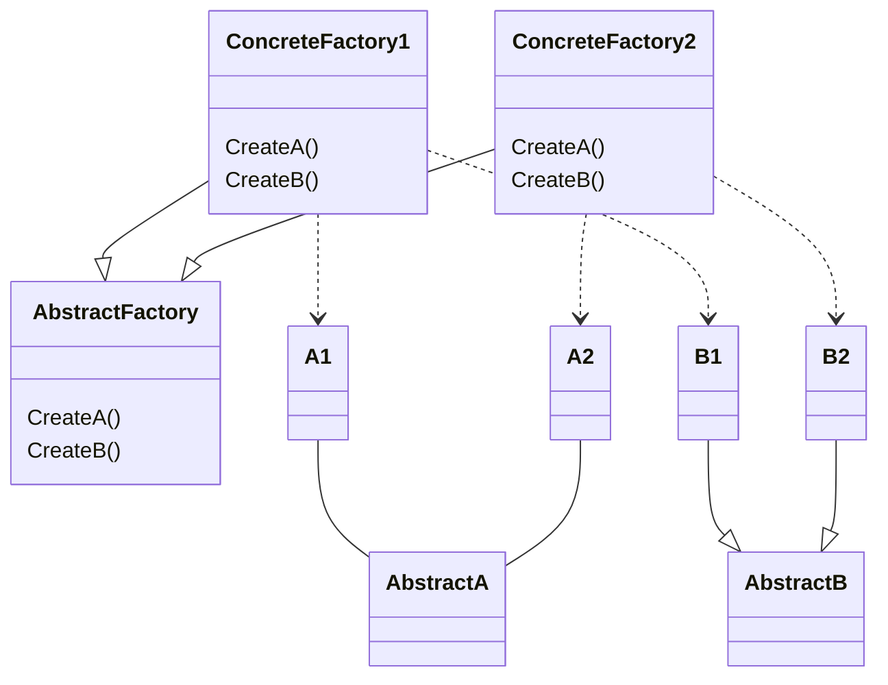
```mermaid
classDiagram
direction TB

   class AbstractFactory{
     CreateA()
     CreateB()
   }
   

   class ConcreteFactory1{
   	 CreateA()
     CreateB()
   }

   class ConcreteFactory2{
   	 CreateA()
     CreateB()
   }
   
   ConcreteFactory1--|>AbstractFactory
   ConcreteFactory2--|>AbstractFactory

  
		class AbstractA
     
     class A2
     A1--AbstractA
     A2--AbstractA

   
	 
     class AbstractB
     class B1
     class B2 
     B1--|>AbstractB
     B2--|>AbstractB


     ConcreteFactory1..>A1
     ConcreteFactory1..>B1

     ConcreteFactory2..>A2
     ConcreteFactory2..>B2
   
   
```

- Decide if "platform independence" and creation services are the current source of pain.
- Map out a matrix of "platforms" versus "products".
- Define a factory interface that consists of a factory method per product.
- Define a factory derived class for each platform that encapsulates all references to the `new` operator.
- The client should retire all references to `new`, and use the factory methods to create the product objects.

```cpp
// Purpose.  Abstract Factory design pattern demo.
// 
// Discussion.  "Think of constructors as factories that churn out objects".
// Here we are allocating the constructor responsibility to a factory object,
// and then using inheritance and virtual member functions to provide a
// "virtual constructor" capability.  So there are two dimensions of
// decoupling occurring.  The client uses the factory object instead of "new"
// to request instances; and, the client "hard-wires" the family, or class, of
// that factory only once, and throughout the remainder of the application
// only relies on the abstract base class.

#include <iostream.h>

class Shape {
public:
   Shape()              { id_ = total_++; }
   virtual void draw()  = 0;
protected:
   int         id_;
   static int  total_;
};
int Shape::total_ = 0;

class Circle : public Shape { public:
   void draw() { cout << "circle " << id_ << ": draw" << endl; } };
class Square : public Shape { public:
   void draw() { cout << "square " << id_ << ": draw" << endl; } };
class Ellipse : public Shape { public:
   void draw() { cout << "ellipse " << id_ << ": draw" << endl; } };
class Rectangle : public Shape { public:
   void draw() { cout << "rectangle " << id_ << ": draw" << endl; } };

class Factory { public:
   virtual Shape* createCurvedInstance()   = 0;
   virtual Shape* createStraightInstance() = 0;
};
class SimpleShapeFactory : public Factory { public:
   Shape* createCurvedInstance()   { return new Circle; }
   Shape* createStraightInstance() { return new Square; }
};
class RobustShapeFactory : public Factory { public:
   Shape* createCurvedInstance()   { return new Ellipse; }
   Shape* createStraightInstance() { return new Rectangle; }
};

void main() {
#ifdef SIMPLE
   Factory*  factory = new SimpleShapeFactory;
#elif ROBUST
   Factory*  factory = new RobustShapeFactory;
#endif
   Shape*    shapes[3];

   shapes[0] = factory->createCurvedInstance();   // shapes[0] = new Ellipse;
   shapes[1] = factory->createStraightInstance(); // shapes[1] = new Rectangle;
   shapes[2] = factory->createCurvedInstance();   // shapes[2] = new Ellipse;

   for (int i=0; i < 3; i++)
      shapes[i]->draw();
}

// ellipse 0: draw
// rectangle 1: draw
```


## builder

将一个复杂对象的构建与它的表示分离，使得同样的构建过程可以创建不同的表示。

使用向导指导 builder 构建部件

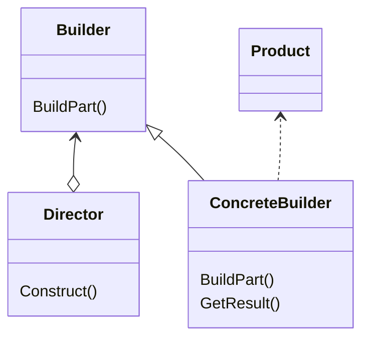
```mermaid
classDiagram
direction BT

   class Director{
     Construct()
   }
   

   class Builder{
   	 BuildPart()
   }

   class ConcreteBuilder{
   	 BuildPart()
     GetResult()
   }
   

   Director o--> Builder
   ConcreteBuilder --|> Builder
   ConcreteBuilder ..> Product

```

```pseudocode
Director::Construct()
for all objects in structure{
	builder->BuildPart
}
```

- 将一个复杂对象的构建(director)与它的表示(builder)分离
- 不同的Director可以复用它以在相同部件集合的基础上构作不同的 Product
- 它使你可对构造过程进行更精细的控制, Builder模式与一下子就生成产品的创建型模式不同，它是在导向者的控制下一步一步构造产品的

## factory method

定义一个用于创建对象的接口, 让子类决定实例化哪一个类, FactoryMethod使一个类的实例化延迟到其子类。

框架使用抽象类定义和维护对象之间的关系。这些对象的创建通常也由框架负责

当一个类希望由它的子类来指定它所创建的对象的时候

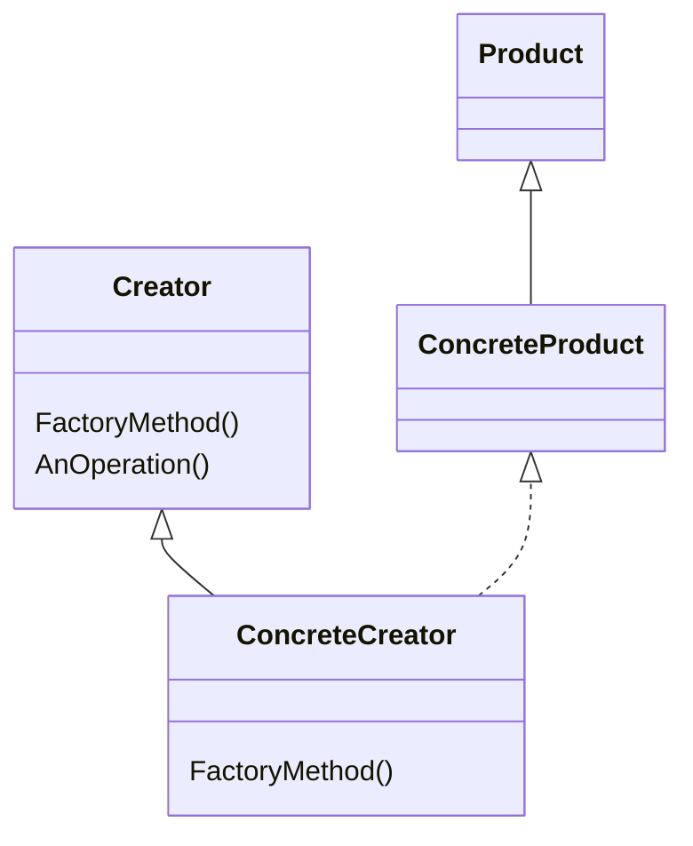
```mermaid
classDiagram
direction BT

   class Creator{
     FactoryMethod()
     AnOperation()
   }
   

   class ConcreteCreator{
   	 FactoryMethod()
   }
   

   ConcreteCreator ..|> ConcreteProduct
   ConcreteCreator --|> Creator
   ConcreteProduct --|> Product

```

```pseudocode
Creator:
product = FactoryMethod()

ConcreteCreator:
return new ConcreteProduct
```

- 工厂方法不再将与特定应用有关的类绑定到你的代码中。代码仅处理Prodact 因此它可以与用户定义的任何 ConcreteProduct 类一起使用
- 工厂方法的一个潜在缺点在于客户可能仅仅为了创建一个特定的ConcreteProduct对象， 就不得不创建Creator的子类

```cpp
//lazy init
class Creator {
  public:
    Product *GetProduct();

  protected:
    virtual Product *CreateProduct();

  private:
    Product *_product;
};

Product *Creator::GetProduct() {
    if (_product = 0) {
        _product = CreateProduct();
    }
    return _product;
}
```


## prototype

用原型实例指定创建对象的种类，并且通过拷贝这些原型创建新的对象。

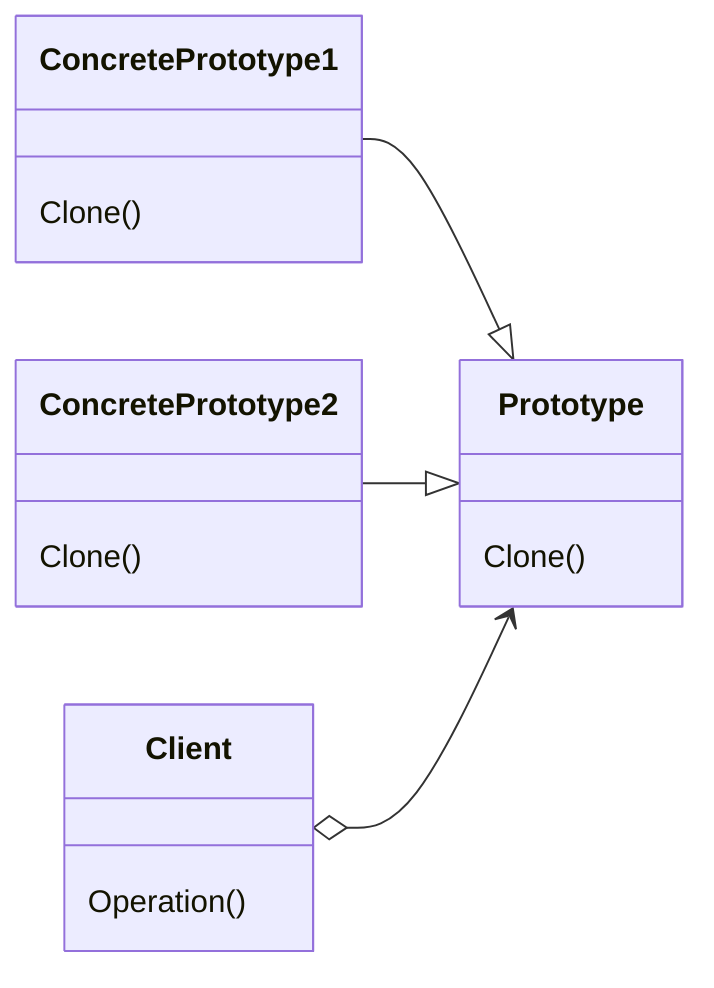
```mermaid
classDiagram
direction LR

   class Client{
     Operation()
   }
   

   class Prototype{
   	 Clone()
   }
   
   class ConcretePrototype1{
   	 Clone()
   }
   
   class ConcretePrototype2{
   	 Clone()
   }
   

   ConcretePrototype1 --|> Prototype
   ConcretePrototype2 --|> Prototype
   Client o--> Prototype

```

```pseudocode
Client:
p = prototype->Clone()
```

- 因为客户可以在运行时刻建立和删除原型。
- 减少子类的构造

## singleton

保证一个类仅有一个实例，并提供一个访问它的全局访问点。

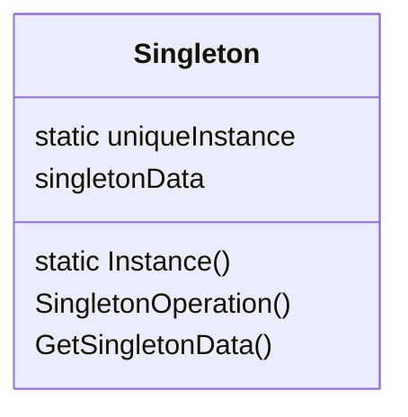
```mermaid
classDiagram
direction LR

   class Singleton{
     static Instance()
     SingletonOperation()
     GetSingletonData()
     static uniqueInstance
     singletonData
   }

```

```pseudocode
static Instance(){
	return uniqueInstance;
}
```

- 类封装唯一实例

# 结构型模式

## adapter/wrapper

将一个类的接口转换成客户希望的另外一个接口。Adapter模式使得原本由于接口不兼容而不能一起工作的那些类可以一起工作。

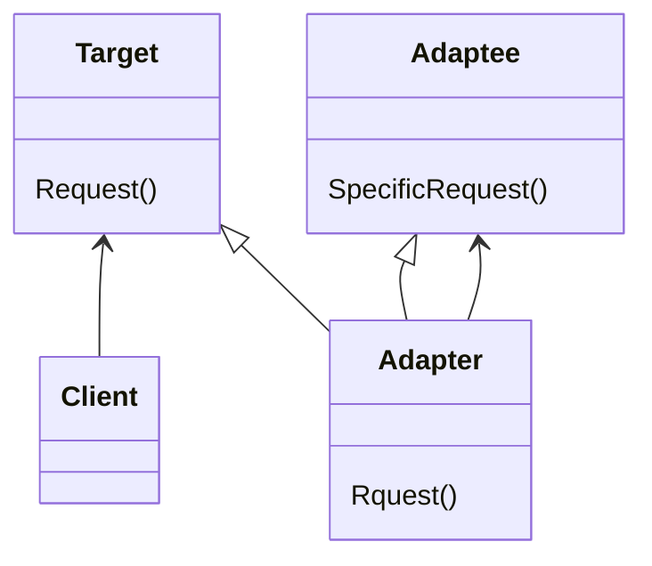
```mermaid
classDiagram
direction BT

   class Client{
   }
   

   class Target{
   	 Request()
   }
   
   class Adaptee{
   	 SpecificRequest()
   }
   
   class Adapter{
   	 Rquest()
   }
   

   Client --> Target
   Adapter --|> Target
   Adapter --|> Adaptee
   %% or
   Adapter --> Adaptee

```

- 使用C++实现适配器类 在使用C++实现适配器类时，Adapter类应该采用公共方式继 承Target 类，并且用私有方式继承Adapiee类

## bridge

将抽象部分与它的实现部分分离，使它们都可以独立地变化。

 Abstraction将client 的请求转发给它的Implementor对象

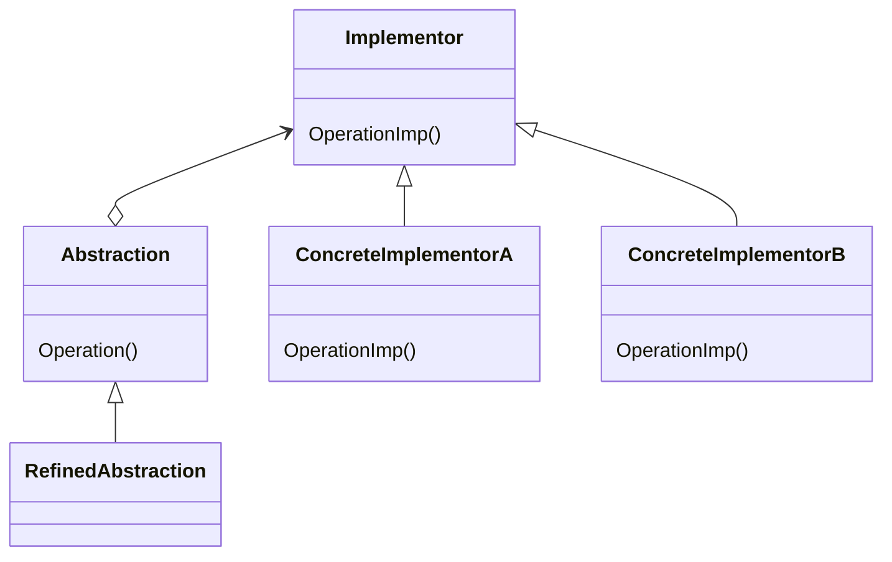
```mermaid
classDiagram
direction BT

   class Abstraction{
   Operation()
   }
   

   class RefinedAbstraction{
   }
   
   class Implementor{
   	 OperationImp()
   }
   
   class ConcreteImplementorB{
   	 OperationImp()
   }
   
   class ConcreteImplementorA{
   	 OperationImp()
   }
   
	 Abstraction o--> Implementor
   RefinedAbstraction --|> Abstraction
   ConcreteImplementorA --|> Implementor
   ConcreteImplementorB --|> Implementor
   


```

- 分离接口及其实现部分 一个实现未必不变地绑定在一个接又上。抽象类的实现可以 在运行时刻进行配置， 一个对象甚至可以在运行时刻改变它的实现
- 

## composite

将对象组合成树形结构以表示〝部分-整体” 的层次结构。Composite使得用户对单个对象 和组合对象的使用具有一致性。

 用户使用Component类接口与组合结构中的对象进行交互。如果接收者是一个叶节点,则直接处理请求。如果接收者是Composite，它通常将请求发送给它的子部件，在转发请求 之前与/或之后可能执行一些辅助操作。

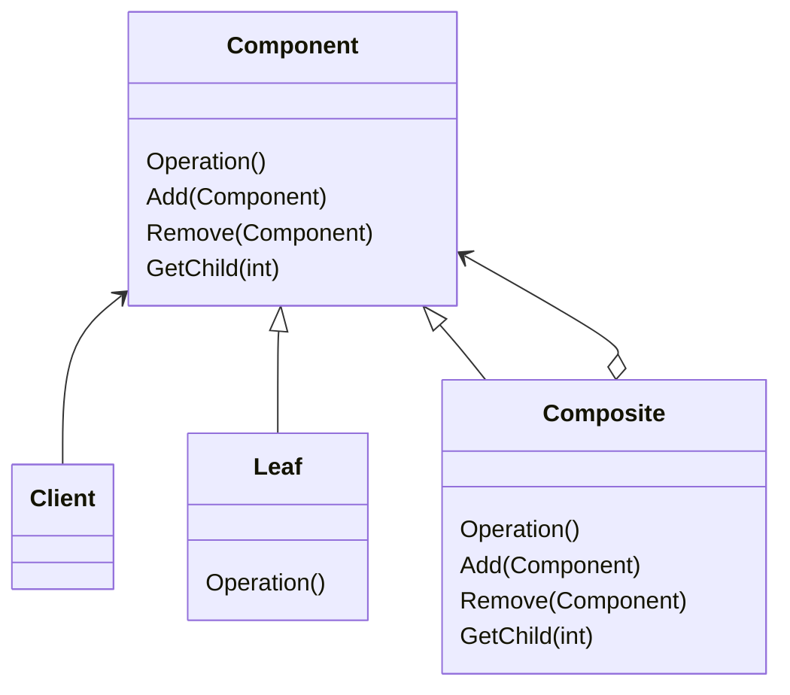
```mermaid
classDiagram
direction BT

   class Client{
   }
   

   class Component{
   Operation()
   Add(Component)
   Remove(Component)
   GetChild(int)
   }
   
   class Leaf{
   	 Operation()
   }
   
   class Composite{
   Operation()
   Add(Component)
   Remove(Component)
   GetChild(int)
   }
   
   
	 Client --> Component
   Leaf --|> Component
   Composite --|> Component
   Composite o--> Component
   


```

```pseudocode
Composite Operation:
for all g in children:
	g.Operation()
```

## decorator/wrapper

动态地给一个对象添加 一些额外的职责。就增加功能来说，Decorator 模式相比生成子类 更为灵活。

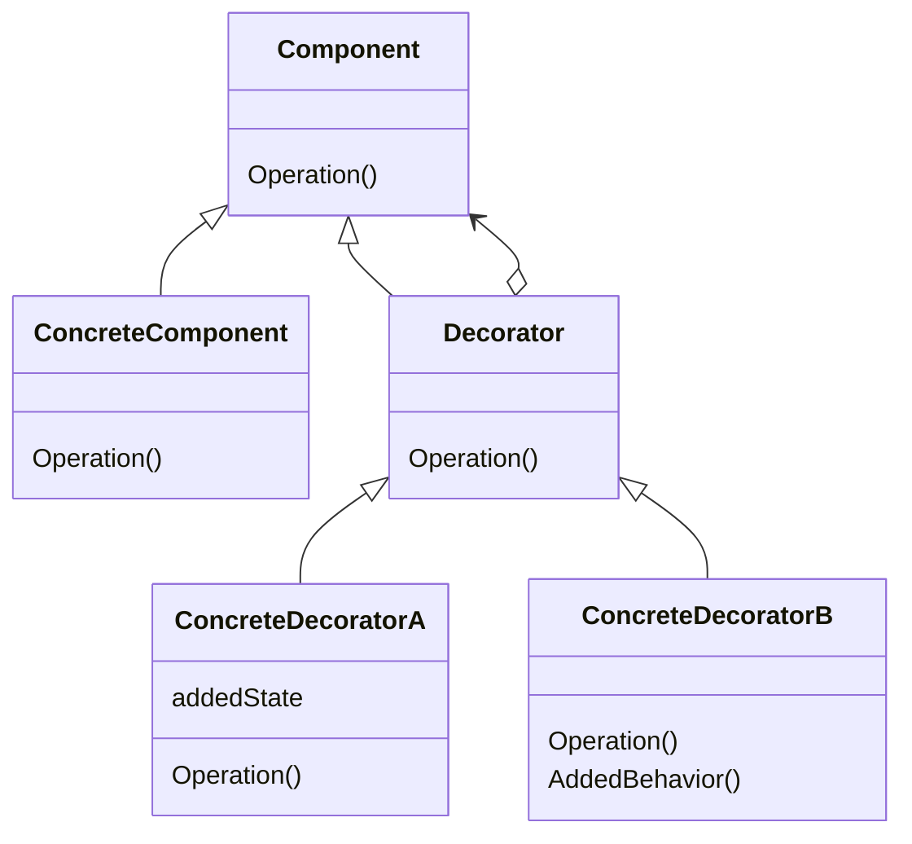
```mermaid
classDiagram
direction BT
   
   class Component{
   Operation()
   }
   
   class ConcreteComponent{
   	 Operation()
   }
   
   class Decorator{
   Operation()
   }
   
   class ConcreteDecoratorA{
   addedState
   	 Operation()
   }
   class ConcreteDecoratorB{
   	 Operation()
   	 AddedBehavior()
   }
   
   
	 ConcreteDecoratorA --|> Decorator
   ConcreteDecoratorB --|> Decorator
    ConcreteComponent --|> Component
   Decorator --|> Component
   Decorator o--> Component
  
   


```

```pseudocode
ConcreteDecoratorB Operation():
Decorator::Operation()
AddedBehavior()

Decorator Operation():
component->Operation()
```

## facade

为子系统中的 一组接口提供 一个 一致的界面

## flyweight

运用共享技术有效地支持大量细粒度的对象。

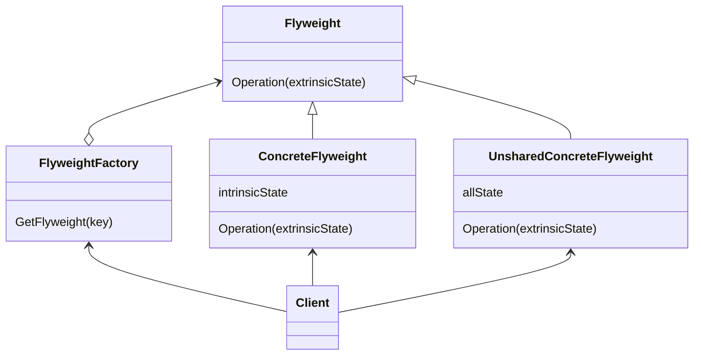
```mermaid
classDiagram
direction BT
   
   class FlyweightFactory{
   GetFlyweight(key)
   }
   
   class Flyweight{
   Operation(extrinsicState)
   }
   
   class ConcreteFlyweight{
   	 Operation(extrinsicState)
   	 intrinsicState
   }
   
   class UnsharedConcreteFlyweight{
   Operation(extrinsicState)
   allState
   }
   
   
   
	 FlyweightFactory o--> Flyweight
   ConcreteFlyweight --|> Flyweight
   UnsharedConcreteFlyweight --|> Flyweight
   Client --> FlyweightFactory
   Client --> ConcreteFlyweight
   Client --> UnsharedConcreteFlyweight
  

```

```pseudocode
FlyweightFactory GetFlyweight(key):
if(flyweight[key] exists){
	return existing flyweight;
}
else{
	create new flyweight;
	add it to pool of flyweights;
	return the new flyweight;
}
```


## proxy

为其他对象提供 一种代理以控制对这个对象的访问。

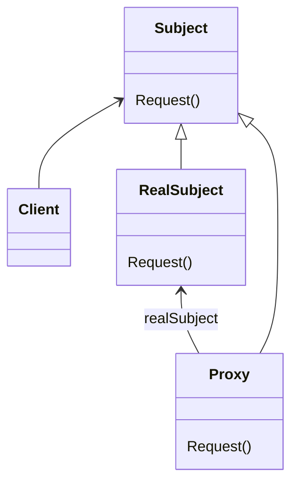
```mermaid
classDiagram
direction BT
   
   class Subject{
   Request()
   }
   
   class RealSubject{
   Request()
   }
   
   class Proxy{
   	 Request()
   }
   
   Client --> Subject
   RealSubject --|> Subject
   Proxy --|> Subject
  Proxy --> RealSubject:realSubject

```


# 行为模式

## CHAINOF RESPONSIBILITY

使多个对象都有机会处理请求，从而避免请求的发送者和接收者之间的耦合关系。将这 些对象连成一条链，并沿着这条链传递该请求，直到有一个对象处理它为止。

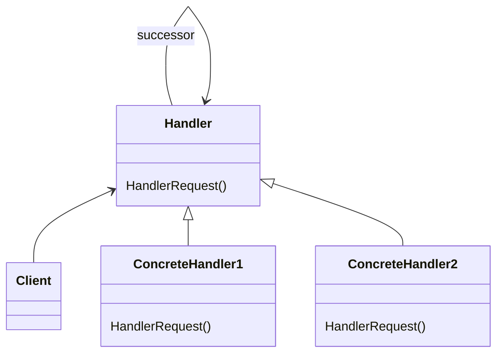
```mermaid
classDiagram
direction BT
   
   class Handler{
   HandlerRequest()
   }
   
   class ConcreteHandler1{
   HandlerRequest()
   }
   
   class ConcreteHandler2{
   HandlerRequest()
   }
   
   Client --> Handler
   Handler --> Handler:successor
   ConcreteHandler1 --|> Handler
  ConcreteHandler2 --|> Handler

```

## command/action/transaction

将1个请求封装为一个对象，从而使你可用不同的请求对客户进行参数化; 对请求排队或记录请求日志，以及支持可撤消的操作

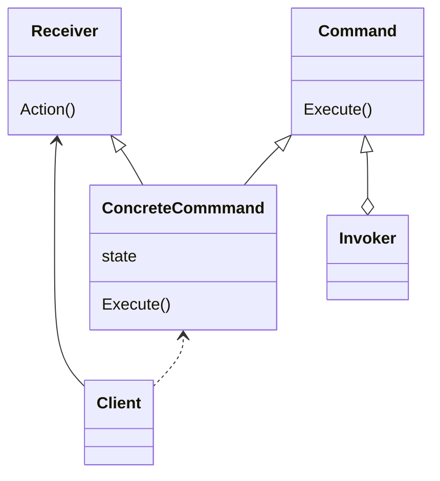
```mermaid
classDiagram
direction BT
   
   class Command{
   Execute()
   }
   
   class ConcreteCommmand{
   Execute()
   state
   }
   
   class Receiver{
   Action()
   }
   
   Client --> Receiver
   Client ..> ConcreteCommmand
   
  ConcreteCommmand --|> Receiver
  ConcreteCommmand --|> Command
  Invoker o--|> Command

```

## INTERPRETER

给定 一个语言，定义它的文法的 一种表示，并定义 一个解释器，这个解释器使用该表示 来解释语言中的句子。

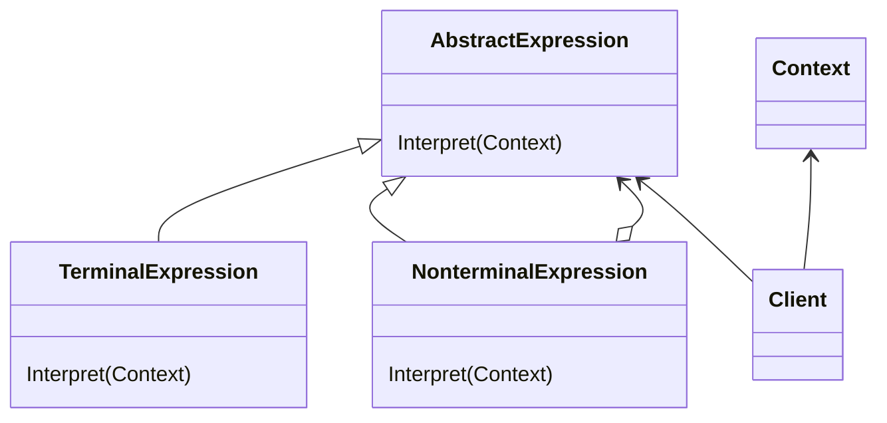
```mermaid
classDiagram
direction BT
   
   class AbstractExpression{
   Interpret(Context)
   }
   
   class TerminalExpression{
   Interpret(Context)
   }
   
   class NonterminalExpression{
   Interpret(Context)
   }
   
  
   TerminalExpression --|> AbstractExpression
  NonterminalExpression --|> AbstractExpression
  NonterminalExpression o--> AbstractExpression
 Client --> Context
   Client --> AbstractExpression
```

## iterator

## mediator

用一 个中介对象来封装一系列的对象交互。中介者使各对象不需要显式地相互引用，从 而使其耦合松散，而且可以独立地改变它们之间的交互。

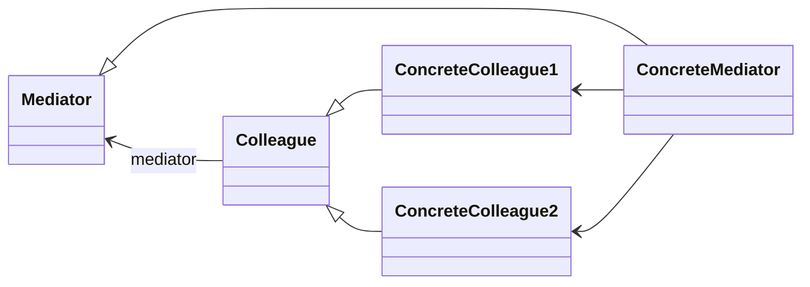
```mermaid
classDiagram
direction RL
   
   ConcreteMediator --|> Mediator
   Colleague --> Mediator:mediator
   ConcreteMediator --> ConcreteColleague1
   ConcreteMediator --> ConcreteColleague2
   ConcreteColleague1 --|> Colleague
   ConcreteColleague2 --|> Colleague
```

## memento

在不破坏封装性的前提下，捕获一个对象的内部状态，并在该对象之外保存这个状态。 这样以后就可将该对象恢复到原先保存的状态。

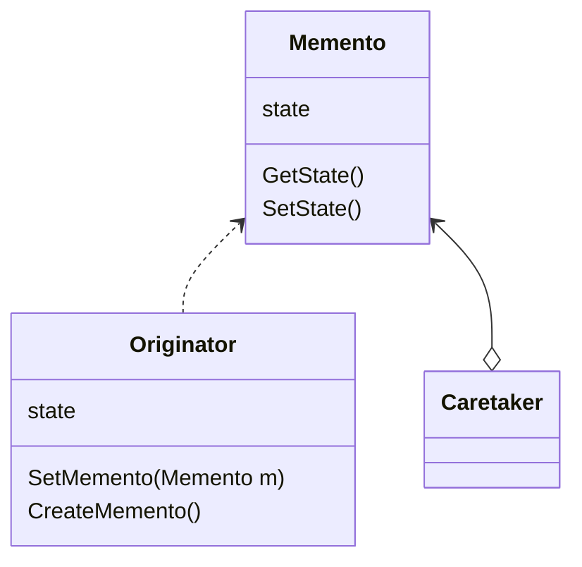
```mermaid
classDiagram
direction BT
class Originator{
SetMemento(Memento m)
CreateMemento()
state
}

class Memento{
GetState()
SetState()
state
}
Originator ..> Memento
Caretaker o--> Memento

```

## observer

定义对象间的一种一对多的依赖关系, 当一个对象的状态发生改变时，所有依赖于它的对象 都得到通知并被自动更新。

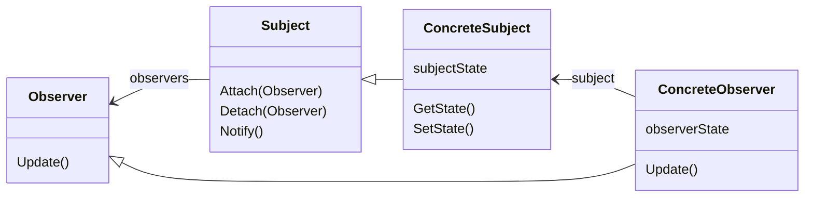
```mermaid
classDiagram
direction RL
class Subject{
  Attach(Observer)
  Detach(Observer)
  Notify()
}

class ConcreteSubject{
  GetState()
  SetState()
  subjectState
}

class Observer{
	Update()
}

class ConcreteObserver{
	Update()
	observerState
}

Subject --> Observer :observers
ConcreteSubject --|> Subject
ConcreteObserver --|> Observer
ConcreteObserver --> ConcreteSubject:subject

```

## state

允许一个对象在其内部状态改变时改变它的行为。对象看起来似乎修改了它的类

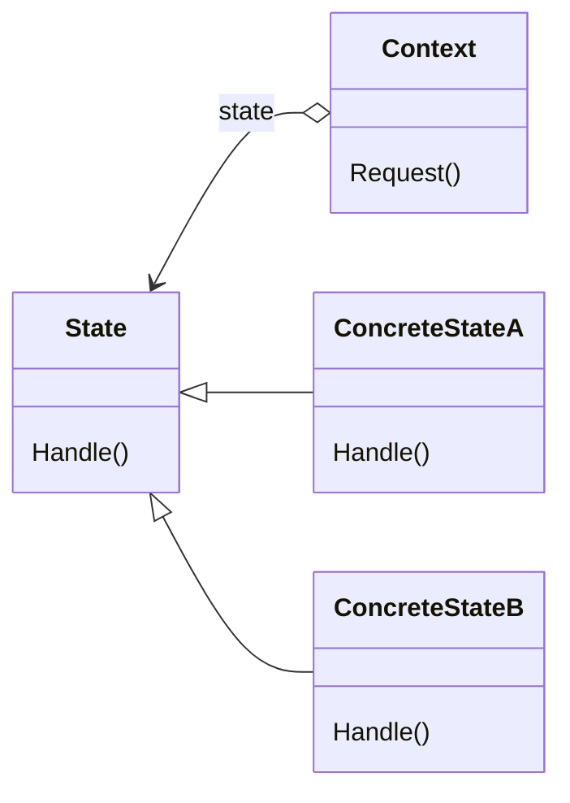
```mermaid
classDiagram
direction RL
class Context{
  Request()
}

class State{
  Handle()
}

class ConcreteStateA{
	Handle()
}

class ConcreteStateB{
	Handle()
}

Context o--> State :state
ConcreteStateA --|> State
ConcreteStateB --|> State

```

## strategy

定义一系列的算法, 把它们一个个封装起来，并且使它们可相互替换。本模式使得算法可独 立 于使用它的 客户而变化。

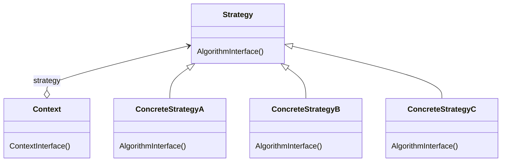
```mermaid
classDiagram
direction BT
class Context{
  ContextInterface()
}

class Strategy{
  AlgorithmInterface()
}

class ConcreteStrategyA{
  AlgorithmInterface()
}
class ConcreteStrategyB{
  AlgorithmInterface()
}
class ConcreteStrategyC{
  AlgorithmInterface()
}

Context o--> Strategy :strategy
ConcreteStrategyA --|> Strategy
ConcreteStrategyB --|> Strategy
ConcreteStrategyC --|> Strategy

```

## template

定义 一个操作中的算法的骨架，而将一些步骤延迟到子类中。TemplateMethod使得子类 可以不改变 一个算法的结构即可重定义该算法的某些特定步骤。

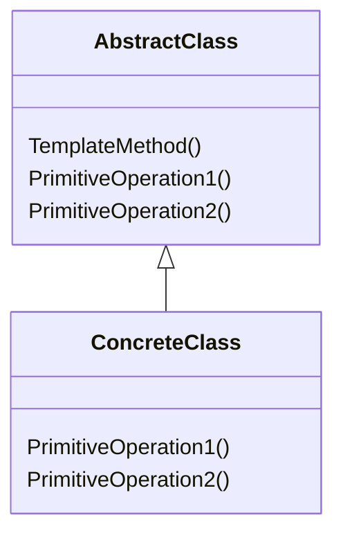
```mermaid
classDiagram
direction BT
class AbstractClass{
  TemplateMethod()
  PrimitiveOperation1()
    PrimitiveOperation2()
}

class ConcreteClass{
  PrimitiveOperation1()
    PrimitiveOperation2()
}
ConcreteClass --|> AbstractClass


```

## visitor

表示一个作用于某对象结构中的各元素的操作。它使你可以在不改变各元素的类的前提 下定义作用于这些元素的新操作。

```mermaid
classDiagram
direction BT
class Visitor{
  VisitConcreteElementA(ConcreteElementA)
  VisitConcreteElementB(ConcreteElementB)
}

class ConcreteVisitor1{
  VisitConcreteElementA(ConcreteElementA)
  VisitConcreteElementB(ConcreteElementB)
}
class ConcreteVisitor2{
  VisitConcreteElementA(ConcreteElementA)
  VisitConcreteElementB(ConcreteElementB)
}

ConcreteVisitor1 --|> Visitor
ConcreteVisitor2 --|> Visitor


class Element{
  Accept(Visitor)
}

class ConcreteElementA{
  Accept(Visitor)
  OperationA()
}

class ConcreteElementB{
  Accept(Visitor)
  OperationB()
}

ConcreteElementA --|> Element
ConcreteElementB --|> Element

Client --> Visitor
Client --> ObjectStructure
ObjectStructure --> Element


```


# 结论


